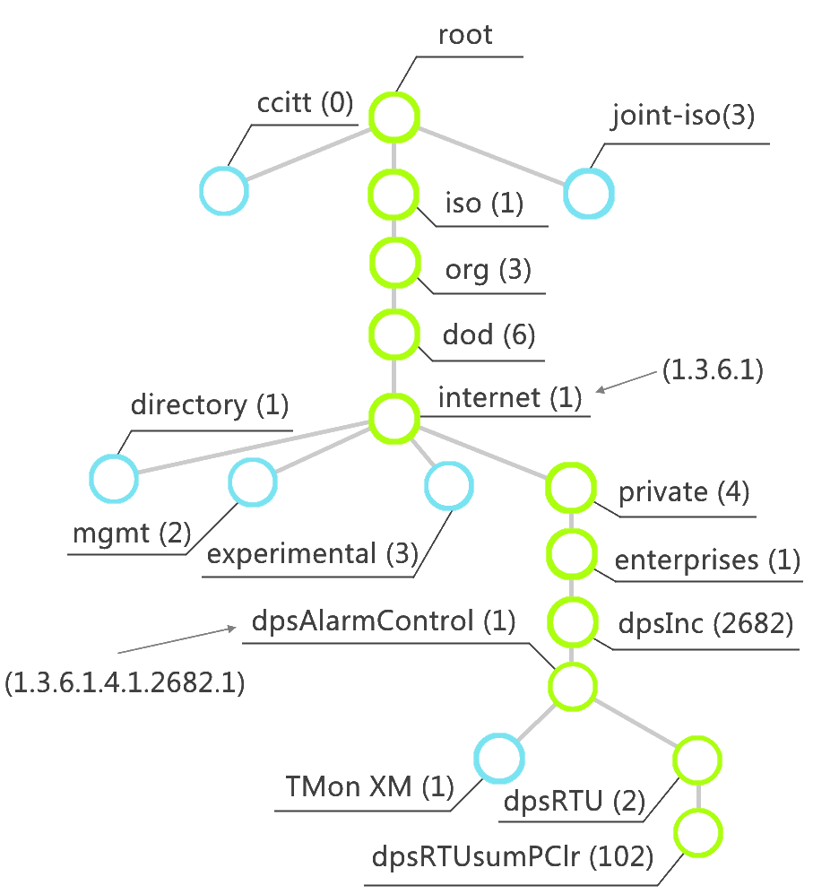
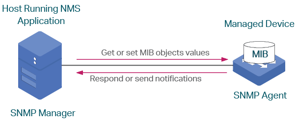

# SNMP Client (NetSNMP daemon helper) #

## SNMP in a nutshell ##

SNMP is a very useful and simple tool for obtaining specific small amounts of data from a machine. It is commonly used for checking machine physical status, like temperature or other sensor readings. User accesses to this properties by requesting oids to the snmp service, and depending on the oid returns the value or nothing if it is not registered.



The relevant operations for our project are Walk and Get:

 - **Get:** user specifies a oid and snmp service returns that only value.
 - **Walk:** it is used for obtaining more than value or getting to endpoints in the oid tree. User specifies a value and it returns all the oids that contain a value under it. How it works is that snmp does getnext requests until the complete tree is walked, this way from each value obtains the next and is the next one to be asked until there are no more to ask for.



SNMP basic functionality can be extended in 3 different ways:

 - **extend:** for delegating a specific oid to a external script
 - **pass:** for delegating a specific oid branch to a script, all the included oids in that branch will be handled here.
 - **pass_persist:** for delegating a specific oid branch to script that will be constantly running, all the included oids in that branch will be handled here.

## SNMP v2 ##
SNMPv2 is very simple and apart from the connection details it only needs to  configure a community string that has certain rights. With the configuration  in the snmpd.conf we will be able to execute locally, the sentence for defining 
the community string is ```rocommunity public``` which gives rights to read when doing snmp requests. Examples for get and walk requests are the following:

```console
snmpget -r 1 -t 15 -v2c -c public localhost .1.3.6.1.4.1.8072.2.255.1.0

NET-SNMP-PASS-MIB::netSnmpPassString.0 = STRING: Life, the Universe, and Everything
```

```console
snmpwalk -r 1 -t 15 -v2c -c public localhost .1.3.6.1.4.1.8072.2.255

NET-SNMP-PASS-MIB::netSnmpPassString.0 = STRING: Life, the Universe, and
Everything
NET-SNMP-PASS-MIB::netSnmpPassInteger.1 = INTEGER: 42
NET-SNMP-PASS-MIB::netSnmpPassOID.1 = OID: NET-SNMP-PASS-MIB::
netSnmpPassOIDValue
NET-SNMP-PASS-MIB::netSnmpPassTimeTicks.0 = Timeticks: (363136200) 42 days,
0:42:42.00
NET-SNMP-PASS-MIB::netSnmpPassIpAddress.0 = IpAddress: 127.0.0.1
NET-SNMP-PASS-MIB::netSnmpPassCounter.0 = Counter32: 42
NET-SNMP-PASS-MIB::netSnmpPassCounter.1 = Wrong Type (should be Counter32):
STRING: "Life, the Universe, and Everything"
NET-SNMP-PASS-MIB::netSnmpPassGauge.0 = Gauge32: 42
```

In the command the snmp version is specified along with the community string (public), the address of the snmp agent (localhost) and the desired OID.
```console
snmpget -r <retries> -t <timeout> -v<version> -c <community_string> <server_ip> <oid>
snmpwalk -r <retries> -t <timeout> -v<version> -c <community_string> <server_ip> <oid>
```

## SNMPv3 ##
This version has the same behaviour as the v2, but adds a security layer by adding authentication and encryption to the requests. For creating users, the snmpd service needs to be stopped at first and then execute the specific instructions for thispurpose. SMPD provides net-snmp-create-v3-user for this purpose and allows the configuration of the writing/reading permissions, user name, the authentication  password and its secure has algorithm, as well as the encryption password and  algorithm. The full command with its options can be observed here:
```console
net-snmp-create-v3-user [-ro] [-A authpass] [-X privpass] [-a MD5|SHA] [-x DES|AES] [username]
```
The most secure and recommendable option that we should use if possible is:
```console
net-snmp-create-v3-user -ro -A <auth_pass> -X <priv_pass> -a SHA -x AES <username>
```
After the result of this command has been succesful it creates a command in /var/lib/snmp/snmpd.conf with creation indications, that when the snmpd service is restarted, transform the plain text authentication variables in hashes and writes the user rights declaration in /usr/share/snmp/snmpd.conf. After this point, the user should be available to do requests using this user with the following commands:
```console
snmpwalk -v3 -l authPriv -u <user> -a SHA -A <auth_pass> -x AES -X <priv_pass> <ip> <oid>
snmpget -v3 -l authPriv -u <user> -a SHA -A <auth_pass> -x AES -X <priv_pass> <ip> <oid>
```

## Our implmentation ##
This project tries to emulate the temperature sensor OIDs defined in netBotz320.mib by extending the main Linux SNMP implementation: NetSNMP. It is recommended to take a look at the mib file with a mib application, like **mibbrowser**. The final target is Data Center Expert (DCE), which should be able to detect the wireless nodes and read their data.

We have sepparated the OIDs in two. The first part are the fixed OIDs. They are fixed in the sense that their values are always the same, they always follow the same order and they do not depend from the nodes data. They all fall under `.1.3.6.1.4.1.318.1.1.10.3`. and they can be found hardcoded in `fixed_oids.py`. This part only support the `get` and `getnext` operations.

The second part is the node table. Its OIDs have the form `.1.3.6.1.4.1.318.1.1.10.5.1.1.1.x.y,`, where `x` is the table entry or value, and `y` is the node index (a certain node or sensor in the table). The table has 24 entries, which can be found in `node_table_oid_manager.y`, in the method `get_oid_value`. Out of those 24 entries, 15 have fixed values while the other 9 ones contain the following node data: mac, name, temperature, humidity, pressure, RSSI, status, battery and location. Besided the `get` and `getnext` operations, the table also support the `set` operation, but only for the name and location fields, which are initialized with a standard value.

The file `node_list.csv`, whose location is set in `snmpd_helper.py`, is a simple CSV file that matches node macs with their index, in order to have a consistency between the OIDs and the sensors across calls and reboots. This file also saves each sensor name and location.

After it has been launched, the program keeps running in the background. This avoids the overhead of starting a python script for each request from NetSNMP. Besides the main thread, which attends the daemon, the program spawns another thread, which periodically reads data from the [gw-app](https://bitbucket.org/tychetools/gw-app/src/master/) (it must enable the SNMP app), and updates each node entry with it. The period is 2 minutes by default, but can be changed inside `snmpd_helper.py`.


### Setup
This project has been implemented as an installable python package, with no dependencies. Inside the root project directory, run the following command to install it:
```
pip3 install .
```

After the installation, a new command is available in the system: `ttsnmpd_helper`. This is the command that needs to be called by the SNMP daemon. An example configuration for the daemon can be found in `snmpd.conf`, which should be copy to `/etc` after updating its pass\_persist directive to point to this new command. More information about it can be found in the official [NetSNMP conf file documentation](http://www.net-snmp.org/docs/man/snmpd.conf.html), under "MIB-Specific Extension Commands". After that, requests that start with `.1.3.6.1.4.1.318` are passed to this program, which replies back to the daemon.


### Examples
Some example commands:

* `snmpwalk -v2c -c public localhost .1.3.6.1.4.1.318` Reads everything (fixed OIDs and the whole node table).
* `snmpwalk -v2c -c public localhost .1.3.6.1.4.1.318.1.1.10.5.1.1.1` Prints the whole node table.
* `snmpwalk -v2c -c public localhost .1.3.6.1.4.1.318.1.1.10.5.1.1.1.2` Prints the mac address of every node.
* `snmpget -v2c -c public localhost .1.3.6.1.4.1.318.1.1.10.5.1.1.1.2.13` Pritns the mac address of the 13th node.
* `snmpset -v2c -c public localhost .1.3.6.1.4.1.318.1.1.10.5.1.1.1.22.31 string "New location"` Sets new location for the 31st node.

## Network Engineering PDU mode

The `nesnmpd_helper` entry point implements `Nee-MIB` v2.4.19 below
`.1.3.6.1.4.1.2000.1`. Net-SNMP owns UDP communication and translates
GETBULK requests into the GETNEXT operations handled by the persistent helper.

The local REST API supplies the system identity, outlet relay/fuse/metering
state, input phase measurements, model, and licence. The current controller API
represents one PDU, so only power table 1 and power-summary row 1 are populated.
The common table code supports four PDU lists when a multi-PDU API is added.
Environmental table rows are deliberately absent until the hardware service
provides environmental sensor data.

Writable MIB values:

* Outlet description, low load limit, and high load limit are persisted in
  `/home/root/snmp/nee_mib_state.json`.
* Outlet `ON`/`OFF` is forwarded to the real output relay API.
* PDU name and phase load limits are persisted and used for SNMP alarms.
* Power-on delay returns `inconsistent-value` because the controller has no
  power-sequencing API.

Fuse and load notifications are sent as SNMPv2c UDP traps on state transitions.
The last alarm state is persisted to suppress duplicates across polling cycles.
Temperature, humidity, wind, and discrete environmental notifications require
an environmental hardware/API provider.

The default PDU configuration grants read-only access to community `public` and
write access to community `private`, restricted to the Nee-MIB subtree. The
configured port, communities, system name/contact/location, and trap managers
are loaded from the NE API settings when SNMP starts.

Numeric examples:

```console
snmpget -v2c -c public HOST .1.3.6.1.4.1.2000.1.1.1.0
snmpwalk -v2c -c public HOST .1.3.6.1.4.1.2000.1
snmpbulkget -v2c -c public -Cn0 -Cr20 HOST .1.3.6.1.4.1.2000.1.2
snmpset -v2c -c private HOST .1.3.6.1.4.1.2000.1.2.1.1.6.1 s OFF
```

